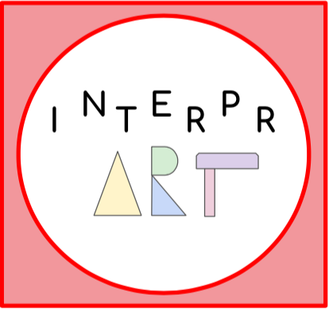

# Design Manifesto

As the semester progressed for us students in CS 376, Human Computer Interaction, the lessons learned were applied to our unique projects in a variety of different ways. Not all lessons were meant to be applied to every situation, but some more general principles can be applied to most, if not all, projects. The most vital principles vary for each designer, which creates a unique process for each one. During the design process, I believe that a user-experience designer must always ponder on the following five points: functionality, communication, memorability, accessibility and a personal code of ethics. 

## Functionality
The first point, functionality, is literally vital to any design process. A product that cannot work cannot be used--no matter how visually appealing the product may be. Prioritizing aesthetic qualities over functional qualities can lead to forgotten but vital functions. For example, my group focused on the images within our [paper prototype](http://mc-mejia.github.io/HCIGroupProject/paperprototype/) before we focused on simple navigational action items, like the back button. Furthermore, lack of consideration for functionality can lead to overcrowding within any page of the design. These extra images could end up distracting from the initial purpose of the design. This became a problem for my group when we tested our [second paper prototype](http://mc-mejia.github.io/HCIGroupProject/img/FinalOverview.jpeg) and found that the community chat page had become overloaded with the visual representation of the community. After experiencing these problems firsthand, I realize that the best way to create an initial prototype is to create a text summary of each page in some sort of unifying template, like an outline. The text-only prototype plan would force a designer to only consider the elements on the page independently of their visual representation and visual mapping within the design. Also, the outline plan allows for less attachment to an initial prototype by emphasizing the functions of each page. 

## Communication
Since a product is rarely the sole creation of one person, it is important that a designer works well with a team. The key to efficient and productive teamwork, my next point, is communication. Before user research, feedback on ideas stems directly from team discussion. When a design is no longer supported by every team member, because of doubt or distaste for any team decision, it becomes much harder to push the validity of said design to others. For example, when my team discussed possible alterations to our video prototype, the suggestions were all small, text-based changes that could be made quickly. The praise for the end result seemed unanimous, but only because some members remained silent about their opinions on the entire video’s overall design. This led to embarrassment and open dismay as our video was presented and after the fact. These initially expressed frustrations became the bulk of our video feedback, which suggests either the audience’s susceptibility to the designers own feelings or the importance of tackling this frustration immediately instead of waiting for feedback that could have been focused on another vital problem. Honesty within a team, no matter how inconvenient it may be, must guide any group discussion. Open communication among team members leads to a more efficient and consistent design process. Good communication also helps to ensure that work is divided evenly among the group as opposed to one or two members doing most of the work for the entire team. 

## Memorability
When it comes to pushing a product out into the “real world,” the memorability of the design is just as important as the design itself. Users of course should be able to properly use a design, but they should also be able to discuss it easily. This is what gives virality to successful smartphone apps and loyalty from consumers to company brands. We not only want a user to enjoy their interaction with our design, but also come back to the product at a later time-- and maybe bring their friends along in the process. For example, our group name, [InterprArt](http://mc-mejia.github.io/HCIGroupProject/), was hard to pronounce by non-team members within our class. Because of this, our team was sometimes referenced by our personal names instead of our collective identity. How can we expect users to reference something that they cannot pronounce easily and intuitively? Furthermore, a product’s logo becomes the visual signal in a user’s memory to the design. So the accompaniment of a simple but effective logo from one good design can become a seal of approval for other designs. A successful product is, after all, a commonly used product. The images below show our initial logo (left) and our final logo after multiple iterations and critiques from teammates, peers, and our professor. 

 

## Accesibility
The digital world is not the most welcoming place for users with a disability. Designers already tend to be very different from their intended user, so adding a disability provides another degree of separation. The most effective way to create a more accessible design is to consider accessibility immediately during every design process. Creating a product and then considering accessibility would increase the difficulty of the design process. For example, I had not considered the importance of alternate text while creating web pages for my group project, so I had to navigate back through all the already-created pages and tediously change all the alternate text on all images. If I had simply written valid and helpful alternate text when I first created these pages, I would have saved my group and myself a substantial amount of time. After my own experience with a pseudo-screen reader in class, I realized the error in overlooking what appeared to me as such a small and unimportant feature. Simulating the problems with accessibility in class showed me the frustrations that certain users must deal with whenever they try to access products that many users and designers take for granted. Furthermore, no step of the design process can be considered universal for accessibility. Even color can affect the accessibility of a design. A user’s own lack of participation should stem from their own personal preferences; not from any barrier. 

## Personal Ethics
Finally, user-experience designers are one cog of an immense machine that is currently morphing humanity’s relationship to technology. And as companies continue to violate the trust of their user’s, the general population slowly becomes to distrust and even dislike any and all forms of technology. I personally believe that all products should provide a user statistics page that details all the data that a product collects on a user. This allows product designers to develop a moral standing among their user base. Only certain pieces of information should be allowed to be collected, and users should be able to cherry pick exactly what they want to share with their product designers. Also, any products that can physically harm a user must be placed under the same strict protocols as agricultural products or pharmaceutical drugs. Testing by an impartial third party should be a vital part of this protocol. Finally, there should be a new branch in government that deals solely with computer ethics that can be the ultimate authority over tech companies. There should be no delegation or interpretation on laws that were written for a different context. This would leave too much ambiguity during court cases. Just as there is a whole unique set of laws for the once new technology of motor vehicles, there should be separate legislation for the new, digital platforms that have emerged in this time period.
